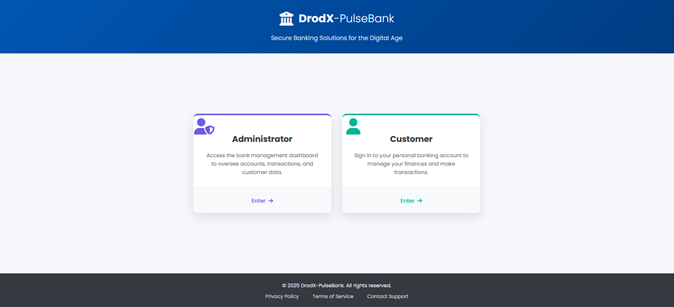
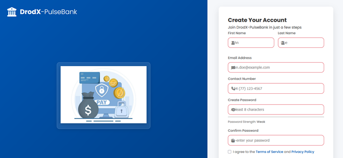
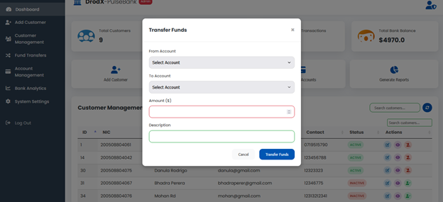

# 🏦 DrodX-PulseBank - Enterprise Banking System (J2EE)

DrodX-PulseBank is a modular, enterprise-level banking system demonstrating secure, scalable, and transactionally consistent enterprise application development using **Jakarta EE**. The system supports **customer and admin operations**, automated banking tasks, and role-based security.

Key features include:

* **EJBs** for business logic and timers
* **JSP** for web interface
* **JPA (EclipseLink)** for persistence
* **Jakarta Security (JAAS)** for authentication & authorization
* **Jakarta Mail** for email notifications
* **CDI, Interceptors, and Timers** for cross-cutting concerns


## 📘 Overview

### 👤 Authentication & Roles

* Custom IdentityStore with JAAS
* Role-based access: Admin, Manager, Customer
* Secure credential storage and validation

### 👨‍💼 Admin Features

* Create and manage customer accounts
* Auto-email new credentials upon registration
* Search/filter customers by ID, name, or email

### 💳 Customer Features

* Secure login & dashboard
* View balances and account details
* One-time and scheduled fund transfers
* Transaction history view

### ⏰ Scheduled Transfers

* EJB @Schedule-driven timer runs every 1 minute
* Automatically processes pending transfers

### 🧾 Transaction Management

* Container-Managed Transactions (CMT) by default
* Bean-Managed Transactions (BMT) for special cases
* Automatic rollback on failure

### 📧 Email Notifications

* Sending emails using Mailtrap
* HTML-templated emails for user notifications

---

## 🛠️ Technology Stack

| Technology        | Usage                          |
| ----------------- | ------------------------------ |
| Jakarta EE 10     | Platform                       |
| EJB               | Business services & timers     |
| JSP               | Web front end                  |
| JPA (EclipseLink) | ORM / persistence              |
| Jakarta Security  | Authentication & authorization |
| Mailtrap          | Email delivery                 |
| CDI               | Dependency Injection           |
| Interceptors      | Audit & logging                |
| Maven             | Build & dependency management  |
| Payara Server 6   | Application server             |

---

## 📂 Project Architecture

```
DrodX-PulseBank-ear/
├── auth/         # Authentication & OTP logic
├── account/      # Account creation, interest processing, deposits (EJB)
├── customer/     # Customer management (EJB)
├── transaction/  # Fund transfers, scheduled transactions, transaction history (EJB)
├── core/         # Entities, DTOs, Interceptors, Exceptions, Services
├── web/          # JSPs, Servlets, Auth Mechanism
└── admin/        # Admin-specific operations
```

### Key Modules & Responsibilities

* **auth:** User authentication, role-based authorization, OTP handling
* **account:** Account management, deposits, interest calculation
* **customer:** Customer operations and profile management
* **transaction:** Internal/external fund transfers, scheduled transactions, transaction history
* **core:** Shared components such as interceptors, exceptions, enums
* **web:** Frontend interface for users and admins
* **admin:** Administrative operations and dashboards

---

## 🔐 User Roles

* **ADMIN:** Manage users, accounts, deposits, audits
* **CUSTOMER:** Log in, transfer funds, schedule transactions, view/download statements

---

## ✨ Key Features Summary

* **Admin Panel:** Dashboard with stats, user/account management, audit & transaction logs
* **Customer Panel:** Fund transfers, transaction history, income/expense charts
* **Scheduled Transactions:** EJB Timer Services for automated execution
* **Monthly Interest:** Calculated automatically via @Schedule EJB timers
* **Role-Based Access Control:** Secured via @RolesAllowed, web.xml, JAAS
* **Email Notifications:** Auto-generated credentials sent via MailTrap
* **Audit Logging:** Cross-cutting auditing using EJB Interceptors
* **Error Handling:** Custom JSP error pages (401, 403, 404, 500)

---

## 💾 Local Setup & Deployment

1. Clone the repository:

```bash
git clone https://github.com/DisanduRodrigo/DrodX-PulseBank.git
```

2. Import the EAR Maven project into **IntelliJ IDEA** or **NetBeans**.
3. Configure MySQL datasource.
4. Build and deploy to **Payara Server**.
5. Access the application via browser.


## 🖼️ Screenshots

### Accounts Select Page



### Register Page



### Sign In Page


### Verify Page


### Admin Dashboard Page


### Customer Dashboard Page


### Fund Transfer Page



---


---

## 🧪 Testing Strategy

* Transaction integrity verified using pessimistic locking and exception simulation
* Timer-based scheduled jobs tested for accurate execution
* Role-based access tested through secured URL patterns and JAAS
* Security tested against unauthorized access and exception handling

---

## 📜 License

This project is part of my professional portfolio and is licensed under the **MIT License**. Please credit the author if reused or adapted.


